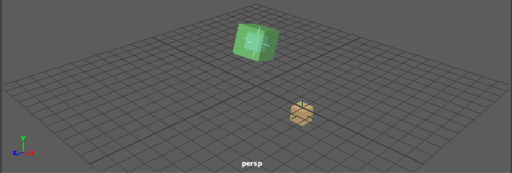
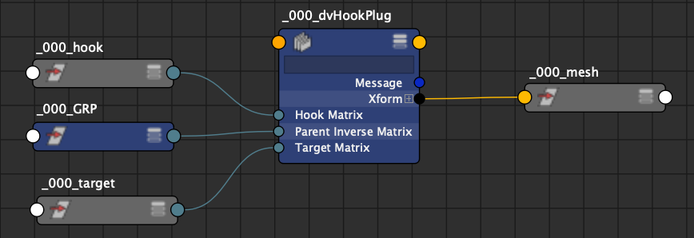

| Plug-ins | maya |
|:--------:|:--------:|
|Mode rig|True|

# dvHOOK


## Presentation
The goal of this node is to compute move one objet on a target refernce and follow one hook.
There is 2 modes rig and anim.
In rig mode you can move hook or target, the plugin store one offset matrix and the output is snap on the target matrix.
In anim mode the plugin read the offset matrix and apply on the hook matrix.


## Attributs

```bash
inputs: {
    rigMode
    targetMatrix
    hookMatrix
    parentInverseMatrix
}

storage: {
    offsetMatrix
}

outputs: {
    xform
        |-translate
        |    |-translateX  
        |    |-translateY  
        |    |-translateZ  
        |-rotate
        |    |-rotateX  
        |    |-rotateY  
        |    |-rotateZ  
        |-scale
        |    |-scaleX  
        |    |-scaleY  
        |    |-scaleZ

}
```
## Node editor Connection


## Commands (python)